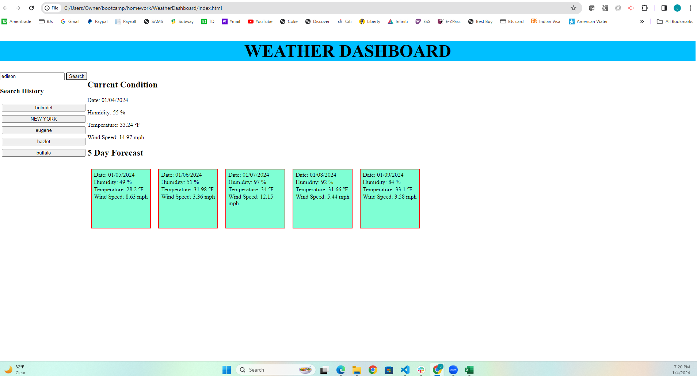

# Weather Dashboard


## Description
```
I had a sense of achievement after completing the 'Weather Dashboard'. I was not only able to apply the basic understandings of HTML, CSS, JavaScript but now there was J-query.  Now you can make travel plans for the upcoming long weekend and enjoy the warm places that you can search using the weather dashboard. I have to give you a heads up about the short coming of this dashboard as it is capable of giving the weather forecast for the upcoming 5 days. I am working on getting this expanded to a greater time length. Till then use, what I can offer right now while my journey to reach Mars continues ........
```


## Repository
```
https://github.com/jsaini1727/WeatherDashboard

```

## Technologies
```
 - This is written with HTML5 and CSS and it is powered by the scripts written in javaScript.
 - HTML follows semantic structure
 - The scripts communicate with third party API and get the data from them to be presented to the user based on their requirement.
```

## Link To Project
```
https://jsaini1727.github.io/WeatherDashboard/
```
## Screenshot Of Live Webpage


